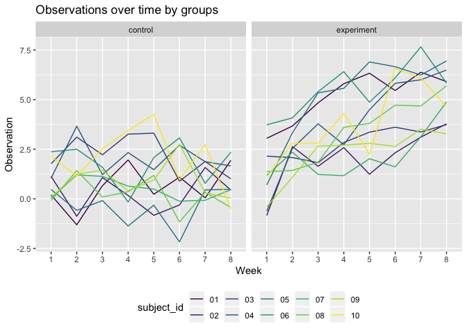

p8105\_hw5\_yc3508
================
Yama Chang
2019/11/9

## Problem 1

**Read and tidy the IRIS data**

``` r
iris_with_missing = iris_with_missing %>%
  janitor::clean_names() 

clean_data = function(x){
  
  if (is.numeric(x)){
    
    x = replace_na(x, mean(x, na.rm = TRUE))
    
  } else if (is.character(x)){
    
    x = replace_na(x, "virginica")
  }
}

iris_cleaned = map(iris_with_missing, clean_data) %>% 
  as_tibble()
```

## Problem 2

**Read and tidy data from a longitudinal study**

``` r
files = list.files("./data", pattern = ".csv", all.files = FALSE, 
full.names = FALSE)

study = data.frame(participants = files) %>% 
  mutate(file_contents = map(participants, ~read.csv(file.path("./data", .)))) %>% 
  separate(participants, into = c("control", "subject_id")) %>% 
  unnest(file_contents) %>% 
  mutate(
    control = recode(control, `con` = "control", `exp` = "experiment")
  ) 
```

    ## Warning: Expected 2 pieces. Additional pieces discarded in 20 rows [1, 2,
    ## 3, 4, 5, 6, 7, 8, 9, 10, 11, 12, 13, 14, 15, 16, 17, 18, 19, 20].

**Plot 1: Show observations on each subject over time**

``` r
Plot_1 = study %>% 
  pivot_longer(week_1:week_8,
               names_to = "week",
               names_prefix = "week_",
               values_to = "observation") %>% 
  ggplot(aes(x = week, y = observation, group = subject_id, color = control)) +
  geom_path() +
  labs(
    title = "Observations over time",
    x = "Week",
    y = "Observation"
  ) + 
  viridis::scale_color_viridis(discrete = TRUE) + 
  theme(legend.position = "bottom")

Plot_1
```

<!-- -->

Comment on Plot 1:

**Plot 2: Show differences between groups**

``` r
Plot_2 = study %>% 
  pivot_longer(week_1:week_8,
               names_to = "week",
               names_prefix = "week_",
               values_to = "observation") %>%
  ggplot(aes(x = week, y = observation, group = subject_id, color = subject_id)) +
  geom_path() + 
  facet_grid(~control) +
  labs(
    title = "Observations over time by groups",
    x = "Week",
    y = "Observation"
  ) + 
  viridis::scale_color_viridis(discrete = TRUE) + 
  theme(legend.position = "bottom")

Plot_2  
```

<!-- -->

Comment on Plot 2:

## Problem 3
