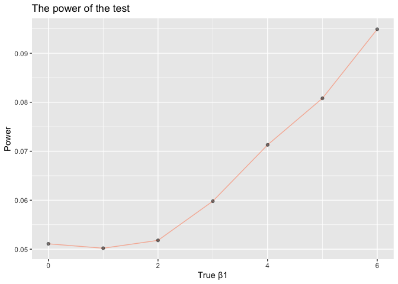
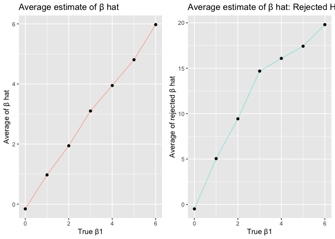

p8105\_hw5\_yc3508
================
Yama Chang
2019/11/9

## Problem 1

Read and tidy the IRIS data

``` r
iris_with_missing = iris_with_missing %>%
  janitor::clean_names() 

clean_data = function(x){
  
  if (is.numeric(x)){
    
    x = replace_na(x, mean(x, na.rm = TRUE))
    
  } else if (is.character(x)){
    
    x = replace_na(x, "virginica")
  }
}

iris_cleaned = map(iris_with_missing, clean_data) %>% 
  as_tibble()
```

## Problem 2

Read and tidy data from a longitudinal study

``` r
files = list.files("./data", pattern = ".csv", all.files = FALSE, 
full.names = FALSE)

study = data.frame(participants = files) %>% 
  mutate(file_contents = map(participants, ~read.csv(file.path("./data", .)))) %>% 
  separate(participants, into = c("control", "subject_id")) %>% 
  unnest(file_contents) %>% 
  mutate(
    control = recode(control, `con` = "control", `exp` = "experiment")
  ) 
```

    ## Warning: Expected 2 pieces. Additional pieces discarded in 20 rows [1, 2,
    ## 3, 4, 5, 6, 7, 8, 9, 10, 11, 12, 13, 14, 15, 16, 17, 18, 19, 20].

**Plot A: A spaghetti plot showing observations on each subject over
time**

``` r
Plot_A = study %>% 
  pivot_longer(week_1:week_8,
               names_to = "week",
               names_prefix = "week_",
               values_to = "observation") %>%
  ggplot(aes(x = week, y = observation, group = subject_id, color = subject_id)) +
  geom_path() + 
  facet_grid(~control) +
  labs(
    title = "Observations over time by groups",
    x = "Week",
    y = "Observation"
  ) + 
  viridis::scale_color_viridis(discrete = TRUE) + 
  theme(legend.position = "bottom")

Plot_A  
```

<!-- -->

In order to compare control and experiment group, we have created Plot A
to present the observations on each subject over time for both groups
separately. While the control group showed irregular change over time,
the experiment group demonstrated increasing effect over time. All
subjects in experiment group have positive effect after 8 weeks.

## Problem 3

Write a function for regression model

``` r
sim_regression = function(n = 30, beta0 = 2, beta1) {
  
  sim_data = tibble(
    x = rnorm(n, mean = 1, sd = 1),
    y = beta0 + beta1 * x + rnorm(n, 0, 50)
  )
  
  ls_fit = lm(y ~ x, data = sim_data) %>% 
    broom::tidy()
  
  ls_fit
}

sim_results = 
  rerun(10000, sim_regression(30, 2, 0)) %>% 
  bind_rows() %>% 
  select(term, estimate, p.value) %>% 
  knitr::kable()
```

Use list columns and map for repeating beta1

``` r
sim_results = 
  tibble(beta1 = c(0, 1, 2, 3, 4, 5, 6)) %>% 
  mutate(
    output_lists = map(.x = beta1, ~rerun(10000, sim_regression(beta1 = .x))),
    estimate_dfs = map(output_lists, bind_rows)) %>% 
  select(-output_lists) %>% 
  unnest(estimate_dfs)
```

Plot C: Show the proportion of times the null was rejected (the power of
the test) on the y axis and the true value of β1 on the x axis

``` r
Plot_C = 
  sim_results %>% 
  filter(term == "x") %>% 
  mutate(
    reject = ifelse(p.value < '0.05', 1, 0)
  ) %>% 
  group_by(beta1) %>% 
  summarise(prop_reject = mean(reject)) %>% 
  ggplot(aes(x = beta1, y = prop_reject)) + 
  geom_line(alpha =.5, color = "coral") + 
  geom_point(alpha = .5) +
  labs(
    title = "The power of the test",
    x = "True β1",
    y = "Power"
  )

Plot_C
```

<!-- -->

The effect and the power of the test is positive correlated.

Plot D: Average estimate of β hat: All value vs rejected H0

``` r
Plot_D1 = 
  sim_results %>% 
  filter(term == "x") %>% 
  mutate(
    reject = ifelse(p.value < '0.05', 1, 0)
  ) %>% 
  group_by(beta1) %>% 
  summarise(mean_beta1 = mean(estimate)) %>% 
  ggplot(aes(x = beta1, y = mean_beta1)) +
  geom_line(alpha =.5, color = "coral") +
  geom_point() +
  labs(
    title = "Average estimate of β hat",
    x = "True β1",
    y = "Average of β hat"
  )

Plot_D2 = sim_results %>% 
  filter(term == "x") %>% 
  mutate(
    reject = ifelse(p.value < '0.05', 1, 0)
  ) %>% 
  filter(reject == 1) %>% 
  group_by(beta1) %>% 
  summarise(mean_beta1 = mean(estimate)) %>% 
  ggplot(aes(x = beta1, y = mean_beta1)) +
  geom_line(alpha =.5, color = "turquoise") +
  geom_point() +
  labs(
    title = "Average estimate of β hat: Rejected H0",
    x = "True β1",
    y = "Average of rejected β hat"
  )

Plot_D1 + Plot_D2
```

<!-- -->

Plot D shows the average estimate of β̂ 1 on the y axis and the true
value of β1 on the x axis (left) and the average estimate of β̂ 1 only
in samples for which the null was rejected on the y axis and the true
value of β1 on the x axis (right). We can tell from the plots that the
average estimates of β̂ 1 are not the same. Both graphs show positive
correlation, however, the average estimate of β̂ 1 in samples for which
the null was rejecte is larger and the graph is steeper. The sample
average of β̂ 1 across tests for rejected null isn’t approximately equal
to the true value of β1. The reason may due to the increasing effect
size.
